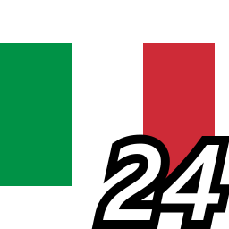
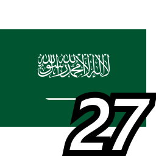
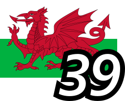

# Flags in PUBG killfeed by suit
## Flags with numbers and 3:2 aspect ratio in your killfeed
This project provides files to customize your PUBG killfeed with flags instead of the default numbers.

## Comparision

|original by Ciseur| new version by suit|
| -- | -- |

This is based on Kowo version shared on his [YouTube video](https://www.youtube.com/watch?v=8OWbQ_wXhpk). The order of flags is consistent, so you can play with someone using his version. 

Loved the idea of flags. They are easier to remember and always liked them. I created this project to improve the readability and add numbers to provide compatibility if you play with people not using the flags.

The project itself was derived from Ciseur and his [ciz-pubg-killfeed-flags]( https://github.com/Ciseur/ciz-pubg-killfeed-flags), the major improvement is the detail especially in replays and spectator cam.

The flags sourced from [Wikimedia Commons](https://commons.wikimedia.org/wiki/Category:National_flags_of_countries), most flags are are native 3:2 but a few other aspect ratio flags have been converted (like the 2:1 from Canada for example).

## Install
To get flags in your PUBG killfeed:

1. Download the [most recent archive on github](https://github.com/suit/pubg-killfeed-flags/releases)
2. Open your windows file explorer and go to %LOCALAPPDATA%\TslGame\Saved
3. Paste "Observer" directory there (it musts contains "TeamInfo.csv" file and the "TeamIcon" directory)
4. Restart PUBG
5. Profit

## List of flags with names (with number)

||||||
| -- | -- | -- | -- | -- |
| Canada| Poland| Finland| Denmark| Brazil|
| Germany| France| United Kingdom| Sweden| Norway|
| Spain| Austria| Turkey| USA| Portugal|
| Argentina| South Korea| Japan| Australia| China|
| Croatia| Greece| Ukraine| Italy| Europe|
| Switzerland| Saudi Arabia| South Africa| Morocco| Thailand|
| Israel| Jamaica| Cuba| Uruguay| Colombia|
| Congo| India| Kenya| Wales| Czech Republic|
| Scotland| Kazakhstan| Ireland| Algeria| Romania|
| Angola| Bahamas| Greenland| Olympics| Pirate|

